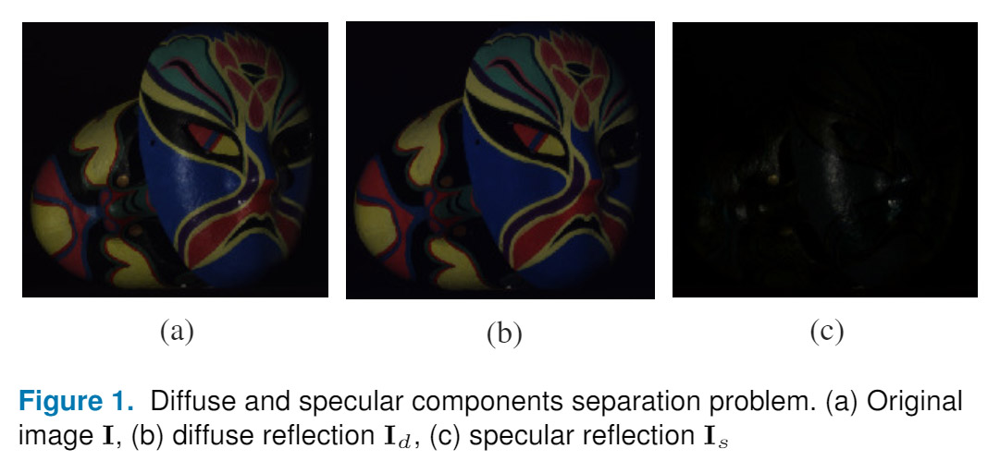

# SIHR: a MATLAB/GNU Octave toolbox for single image highlight removal

[](https://zenodo.org/badge/latestdoi/156116891)
[](https://github.com/vitorsr/SIHR/blob/master/LICENSE)

## Summary

An ongoing effort of developing new and implementing established single image highlight removal (SIHR) methods on MATLAB/GNU Octave.

Highlight, specularity, or specular reflection removal (see <sup>1</sup> for a proper Web of Science expression, see [1] for a reference work entry, see [2], [3] for survey on this problem) concerns the following decomposition.

[](https://link.springer.com/referenceworkentry/10.1007%2F978-0-387-31439-6_532)

I welcome and encourage contributions to this project upon review. Please check [`CONTRIBUTING.md`](CONTRIBUTING.md) for more details.

*Disclaimer 1: this repository is intended for research purposes only.*

*Disclaimer 2: ~~some~~ most of these methods are based on chromaticity analysis, they fail **miserably** for grayscale images.*

<sup>1</sup> `((remov* NEAR/1 (highlight* OR specular*)) OR (separat* NEAR/1 (reflect* OR specular*)))`

### *Raison d'être*

I started out this repository by implementing, translating and collecting code snippets from the *rare* available<sup>2,3,4,5</sup> codes. Oftentimes papers are cryptical, codes are in C/C++ (requires compilation and major source code modification for general testing), or are just unavailable.

In this context, this repository aims to be a continous algorithmic aid for ongoing research and development of SIHR methods.

<sup>2</sup> Tan and Ikeuchi. [Online]. Available: <http://tanrobby.github.io/code/highlight.zip>  
<sup>3</sup> Shen *et al.* [Online]. Available: <http://ivlab.org/publications/PR2008_code.zip>  
<sup>4</sup> ~~Yang *et al.* [Online]. Available: <http://www6.cityu.edu.hk/stfprofile/qiyang.htm>~~  
<sup>5</sup> Shen and Zheng. [Online]. Available: <http://ivlab.org/publications/AO2013_code.zip>

## Usage

Calling this toolbox's functions is **very** straightforward:
```MATLAB
I_d = AuthorYEAR(I); % I is a double-valued input image of dimension
                     % M×N×3 containing linear RGB values and
                     % I_d is the calculated diffuse reflection
                     % using AuthorYEAR method.
                     % The specular component is simply
                     % I_s = I - I_d;
```

### Methods

The following methods are available.

|Year| Method                     | Function       |
|:--:|----------------------------|----------------|
|2005| Tan and Ikeuchi [4]        | `Tan2005`      |
|2006| Yoon *et al.* [5]          | `Yoon2006`     |
|2008| Shen *et al.* [6]          | `Shen2008`     |
|2009| Shen and Cai  [7]          | `Shen2009`     |
|2010| Yang *et al.* [8]          | `Yang2010`     |
|2013| Shen and Zheng [9]         | `Shen2013`     |
|2016| Akashi and Okatani [10]    | `Akashi2016`   |

The following improvement is available.

|Year| Method                     | Function       |
|:--:|----------------------------|----------------|
|2019| Yamamoto and Nakazawa [11] | `Yamamoto2019` |

### Environment

The environment this repository is being developed is:

* [MATLAB](https://www.mathworks.com/products/matlab.html)
    * [Image Processing Toolbox](https://www.mathworks.com/products/image.html)
* [GNU Octave](https://www.gnu.org/software/octave/)
    * [Image package](https://octave.sourceforge.io/image/index.html)
        * `pkg install -forge image`

#### Tested environments

    Octave 4.2                                Ubuntu 18.04
    Octave 5.1 (latest)    Windows 10 1903
    MATLAB 9.1 (R2016b)    Windows 10 1903
    MATLAB 9.6 (R2019a)    Windows 10 1903    Ubuntu 16.04 (MATLAB Online)

### Instalation

1. [`git clone`](https://github.com/vitorsr/SIHR.git) or [download](https://github.com/vitorsr/SIHR/archive/master.zip) the repository.
1. Start Octave or MATLAB.
    1. `cd('path/to/SIHR')` i.e. change current folder to `SIHR` root (where `SIHR.m` is located).
    1. `run SIHR.m` for session path setup.
    1. `help SIHR` or `doc SIHR` provides a summary of the methods available.

## Performance

This section aims to clarify how well (or not) the methods reproduced in this project were at reproducing results in literature.

Note: Akashi and Okatani's [10] method has highly fluctuating results because of random initialization.

### Dataset

In technical literature, there exist two ground truth datasets commonly used right now. One by Shen and Zheng [9] which is informally distributed alongside their code<sup>5</sup>, and one by Grosse *et al.* [12] in a dedicated page<sup>7</sup>. To the best of my knowledge, both are freely distributed without a license (it is of my understanding that the images implicitly exist solely for research purposes).

As a part of the toolbox, I've included Tan and Ikeuchi's<sup>2</sup> [4], Shen *et al.*'s<sup>3</sup> [6] and Shen and Zheng's<sup>5</sup> [9] test images in [`images`](https://github.com/vitorsr/SIHR/tree/master/images).

<sup>7</sup> Grosse *et al.* [Online]. Available: <http://www.cs.toronto.edu/~rgrosse/intrinsic/>

### Quality

Quantitative results reported are usually regarding the quality of the recovered diffuse component with respect to the ground truth available in the Shen and Zheng [9] test image set.

Reproduced results below are available in the [`utils/my_quality.m`](https://github.com/vitorsr/SIHR/blob/master/utils/my_clip.m) script.

#### Highest (self and peer-reported | reproduced) PSNR results (in dB)

|Year| Method             | *animals* | *cups*    | *fruit*   | *masks*   | Reproduced         | *animals* | *cups* | *fruit* | *masks* |
|:--:|--------------------|:---------:|:---------:|:---------:|:---------:|--------------------|:---------:|:------:|:-------:|:-------:|
|2005| Tan and Ikeuchi    | 30.2      | 30.1      | 29.6      | 25.6      | Tan and Ikeuchi    | 30.4      | 31.6   | 30.4    | 25.8    |
|2006| Yoon *et al.*      | -         | -         | -         | -         | Yoon *et al.*      | 32.9      | 33.3   | 36.6    | 34.1    |
|2008| Shen *et al.*      | 34.6      | 37.7      | 37.6      | 31.7      | Shen *et al.*      | 34.2      | 37.5   | 38.0    | 32.1    |
|2009| Shen and Cai       | 34.8      | 37.6      | 36.9      | 34.0      | Shen and Cai       | 34.9      | 37.6   | 36.7    | 34.0    |
|2010| Yang *et al.*      | *37.2*    | 38.0      | 37.6      | 32.2      | Yang *et al.*      | 36.5      | 37.5   | 36.2    | 33.5    |
|2013| Shen and Zheng     | **37.3**  | **39.3**  | *38.9*    | 34.1      | Shen and Zheng     | 37.5      | 38.3   | 38.2    | 32.7    |
|2015| Liu *et al.*       | 33.4      | 37.6      | 35.1      | **34.5**  | -                  | -         | -      | -       | -       |
|2016| Akashi and Okatani | 26.8      | 35.7      | 30.8      | 32.3      | Akashi and Okatani | 32.7      | 35.9   | 34.8    | 34.0    |
|2016| Suo *et al.*       | -         | -         | **40.4**  | 34.2      | -                  | -         | -      | -       | -       |
|2017| Ren *et al.*       | -         | 38.0      | 37.7      | **34.5**  | -                  | -         | -      | -       | -       |
|2018| Guo *et al.*       | 35.7      | *39.1*    | 36.4      | *34.4*    | -                  | -         | -      | -       | -       |

#### Highest (self and peer-reported | reproduced) SSIM results

|Year| Method             | *animals* | *cups*    | *fruit*   | *masks*   | Reproduced         | *animals* | *cups* | *fruit* | *masks* |
|:--:|--------------------|:---------:|:---------:|:---------:|:---------:|--------------------|:---------:|:------:|:-------:|:-------:|
|2005| Tan and Ikeuchi    | 0.929     | 0.767     | 0.912     | 0.789     | Tan and Ikeuchi    | 0.928     | 0.895  | 0.907   | 0.821   |
|2006| Yoon *et al.*      | -         | -         | -         | -         | Yoon *et al.*      | 0.980     | 0.961  | 0.961   | 0.953   |
|2008| Shen *et al.*      | *0.974*   | 0.962     | **0.961** | *0.943*   | Shen *et al.*      | 0.975     | 0.962  | 0.961   | 0.943   |
|2009| Shen and Cai       | -         | -         | -         | -         | Shen and Cai       | 0.985     | 0.970  | 0.962   | 0.961   |
|2010| Yang *et al.*      | 0.970     | 0.941     | 0.939     | 0.899     | Yang *et al.*      | 0.952     | 0.937  | 0.916   | 0.896   |
|2013| Shen and Zheng     | 0.971     | **0.966** | *0.960*   | 0.941     | Shen and Zheng     | 0.985     | 0.964  | 0.958   | 0.935   |
|2015| Liu *et al.*       | -         | -         | -         | -         | -                  | -         | -      | -       | -       |
|2016| Akashi and Okatani | 0.802     | 0.937     | 0.765     | 0.657     | Akashi and Okatani | 0.7340    | 0.9190 | 0.9010  | 0.8710  |
|2016| Suo *et al.*       | -         | -         | -         | -         | -                  | -         | -      | -       | -       |
|2017| Ren *et al.*       | 0.896     | 0.957     | 0.952     | 0.913     | -                  | -         | -      | -       | -       |
|2018| Guo *et al.*       | **0.975** | *0.963*   | 0.930     | **0.955** | -                  | -         | -      | -       | -       |

## References

<small>

1. R. T. Tan, “Specularity, Specular Reflectance,” in Computer Vision, Springer US, 2014, pp. 750–752 [Online]. Available: <http://dx.doi.org/10.1007/978-0-387-31439-6_538>

1. A. Artusi, F. Banterle, and D. Chetverikov, “A Survey of Specularity Removal Methods,” Computer Graphics Forum, vol. 30, no. 8, pp. 2208–2230, Aug. 2011 [Online]. Available: <http://dx.doi.org/10.1111/J.1467-8659.2011.01971.X>

1. H. A. Khan, J.-B. Thomas, and J. Y. Hardeberg, “Analytical Survey of Highlight Detection in Color and Spectral Images,” in Lecture Notes in Computer Science, Springer International Publishing, 2017, pp. 197–208 [Online]. Available: <http://dx.doi.org/10.1007/978-3-319-56010-6_17>

1. R. T. Tan and K. Ikeuchi, “Separating reflection components of textured surfaces using a single image,” IEEE Transactions on Pattern Analysis and Machine Intelligence, vol. 27, no. 2, pp. 178–193, Feb. 2005 [Online]. Available: <http://dx.doi.org/10.1109/TPAMI.2005.36>

1. K. Yoon, Y. Choi, and I. S. Kweon, “Fast Separation of Reflection Components using a Specularity-Invariant Image Representation,” in 2006 International Conference on Image Processing, 2006 [Online]. Available: <http://dx.doi.org/10.1109/ICIP.2006.312650>

1. H.-L. Shen, H.-G. Zhang, S.-J. Shao, and J. H. Xin, “Chromaticity-based separation of reflection components in a single image,” Pattern Recognition, vol. 41, no. 8, pp. 2461–2469, Aug. 2008 [Online]. Available: <http://dx.doi.org/10.1016/J.PATCOG.2008.01.026>

1. H.-L. Shen and Q.-Y. Cai, “Simple and efficient method for specularity removal in an image,” Applied Optics, vol. 48, no. 14, p. 2711, May 2009 [Online]. Available: <http://dx.doi.org/10.1364/AO.48.002711>

1. Q. Yang, S. Wang, and N. Ahuja, “Real-Time Specular Highlight Removal Using Bilateral Filtering,” in Computer Vision – ECCV 2010, Springer Berlin Heidelberg, 2010, pp. 87–100 [Online]. Available: <http://dx.doi.org/10.1007/978-3-642-15561-1_7>

1. H.-L. Shen and Z.-H. Zheng, “Real-time highlight removal using intensity ratio,” Applied Optics, vol. 52, no. 19, p. 4483, Jun. 2013 [Online]. Available: <http://dx.doi.org/10.1364/AO.52.004483>

1. Y. Akashi and T. Okatani, “Separation of reflection components by sparse non-negative matrix factorization,” Computer Vision and Image Understanding, vol. 146, pp. 77–85, May 2016 [Online]. Available: <http://dx.doi.org/10.1016/j.cviu.2015.09.001>

1. T. Yamamoto and A. Nakazawa, “General Improvement Method of Specular Component Separation Using High-Emphasis Filter and Similarity Function,” ITE Transactions on Media Technology and Applications, vol. 7, no. 2, pp. 92–102, 2019 [Online]. Available: <http://dx.doi.org/10.3169/mta.7.92>

1. R. Grosse, M. K. Johnson, E. H. Adelson, and W. T. Freeman, “Ground truth dataset and baseline evaluations for intrinsic image algorithms,” in 2009 IEEE 12th International Conference on Computer Vision, 2009 [Online]. Available: <http://dx.doi.org/10.1109/ICCV.2009.5459428>

</small>
