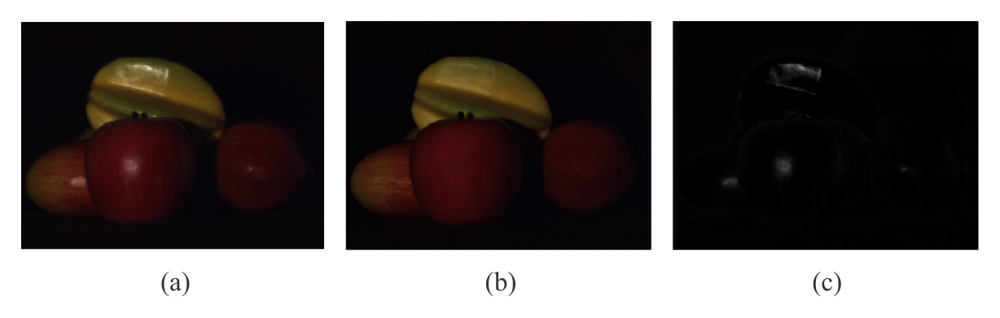

# Summary

Single image highlight removal (SIHR) refers to an open problem in computer vision concerning the separation of diffuse and specular reflection components from a single image [@Tan2014]. Briefly, the diffuse component refers to a generally low-parametric reflection that takes the color of the body, while the specular component refers to a higher-frequency reflection that takes the color of the illuminant. Under the dichromatic reflection model [@Shafer1985], they are linearly additive. It is an intrinsic image decomposition, so it has several applications. Recently, there was an interest renewal in this problem for the objective of image enhancement in visual display systems such as TVs [@Yamamoto2017].

The primary objective of this toolbox is to serve as an aid for ongoing research and development of SIHR methods. Being written in such a high-level language that is MATLAB/GNU Octave allows an easier understanding of the inner workings of these methods. To the best of our knowledge, the resources available to further the understanding of this specific problem are relatively scarce.

Hence, we have started ``SIHR`` to implement and gather several different methods from technical literature--starting from the most performing ones, since the abovementioned systems operate on a limited computing budget and need timely processing. Other methods of interest can be found in recent surveys [@Artusi2011; @Khan2017].

Usage is rather straightforward as the focus of these methods is to work with only a single linear RGB image, i.e. an *m*×*n*×3 matrix. For uniformity, we ask the image to be double-valued. In ``SIHR``, calls are simply ``I_d = AuthorYEAR(I);``, in which ``I`` is the original image and ``I_d`` is the diffuse component estimate calculated by the ``AuthorYEAR`` method. The specular component is ``I_s = I - I_d;``.

As of time of writing, the following methods are available. We refer to the ``SIHR`` documentation for the latest list of methods available.

| Function      | Method        | PSNR (dB) | SSIM  | Runtime (s) |
|:-------------:|:-------------:|:---------:|:-----:|:-----------:|
| `Tan2005`     | @Tan2005      | 29.5      | 0.888 | 160         |
| `Yoon2006`    | @Yoon2006     | 34.2      | 0.964 | 2.6         |
| `Shen2008`    | @Shen2008     | 35.5      | 0.960 | 4.7         |
| `Shen2009`    | @Shen2009     | 35.8      | 0.970 | 0.26        |
| `Yang2010`    | @Yang2010     | 35.9      | 0.925 | 0.16        |
| `Shen2013`    | @Shen2013     | 36.7      | 0.960 | 0.063       |
| `Akashi2016`  | @Akashi2016   | 34.3      | 0.856 | 180         |

Table: List of methods in `SIHR`

| Function       | Method        |
|:--------------:|:-------------:|
| `Yamamoto2019` | @Yamamoto2019 |

Table: List of improvements in `SIHR`

Figure 1 presents an actual result of a method from technical literature which was implemented in ``SIHR``. In Table 1, the reproduced metrics are from the @Shen2013 dataset, and were averaged--for each metric--for all four images.

``SIHR`` aims to be a continuous project and welcomes community contributions. The source code for ``SIHR`` is being archived by Zenodo since its pre-release version [@Ramos2019].

# References
